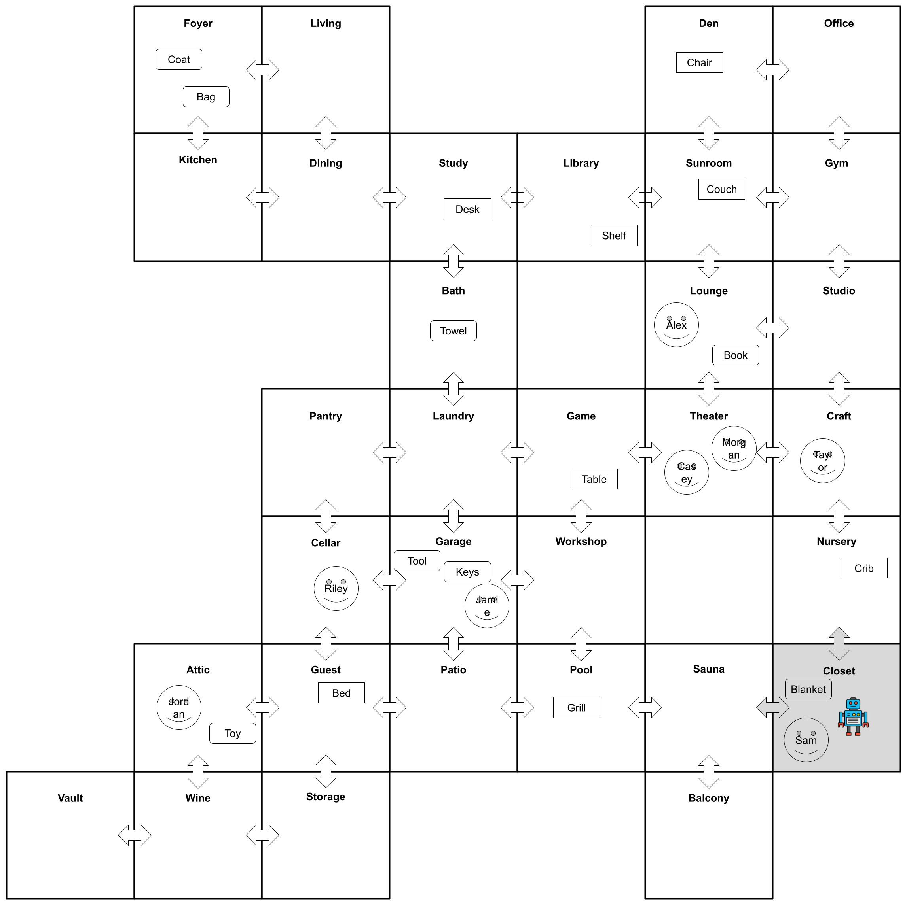
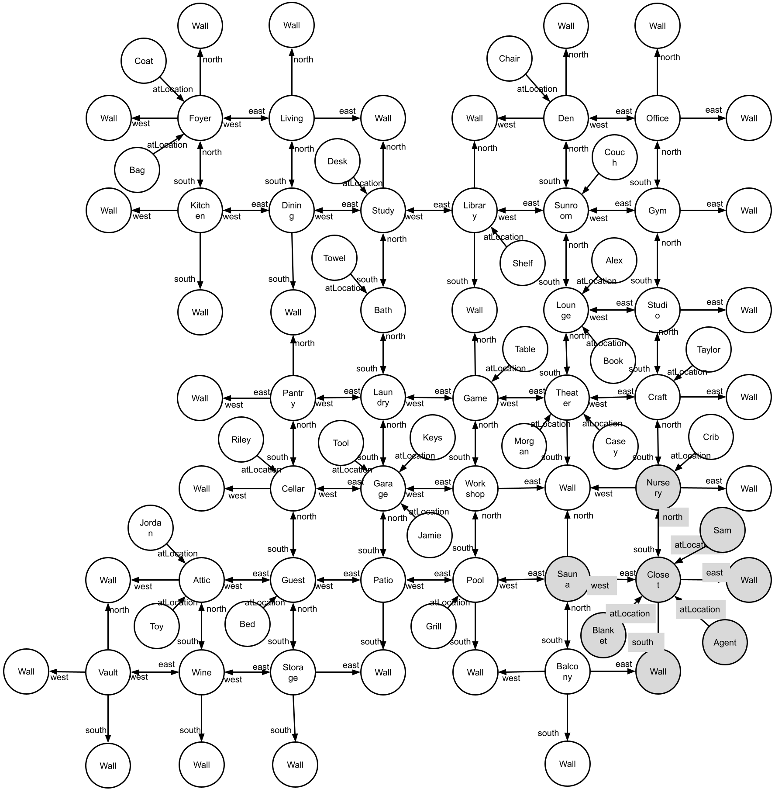

# The Room environment - v2

[](https://arxiv.org/pdf/2408.05861)

We have released a challenging [Gymnasium](https://www.gymlibrary.dev/) compatible
environment. See the paper for more information.



Check out the leaderboard
[https://paperswithcode.com/sota/roomenv-v2-on-roomenv-v2](https://paperswithcode.com/sota/roomenv-v2-on-roomenv-v2)

## Prerequisites

1. A unix or unix-like x86 machine
1. python 3.10 or higher.
1. Running in a virtual environment (e.g., conda, virtualenv, etc.) is highly recommended so that you don't mess up with the system python.
1. This env is added to the PyPI server. Just run: `pip install room-env`

## Creating a RoomEnv-v2

```python
import random
from room_env.create_room_v2 import RoomCreator

room_creator = RoomCreator(
    filename="dev",
    grid_length=7,
    num_rooms=32,
    num_static_objects=8,
    num_independent_objects=8,
    num_dependent_objects=8,
    room_prob=0.5,
    minimum_transition_stay_prob=0.6,
    static_object_in_every_room=False,
    give_fake_names=False,
)
room_creator.run()
```

[`./room-env-v2.ipynb`](./room-env-v2.ipynb) has some good examples.

## Running a RoomEnv-v2

```python
import gymnasium as gym
import random

env = gym.make("room_env:RoomEnv-v2")
observations, info = env.reset()
rewards = 0

while True:
    observations, reward, done, truncated, info = env.step(
        (
            ["random answer"] * len(observations["questions"]),
            random.choice(["north", "east", "south", "west", "stay"]),
        )
    )
    rewards += reward
    if done or truncated:
        break

# You can also get the map of the rooms
room_layout = env.unwrapped.return_room_layout(exclude_walls=True)

# Get the entities of the env
entities = env.unwrapped.entities

# Get the relations of the env
relations = env.unwrapped.relations

# See when the env terminates
terminates_at = env.unwrapped.terminates_at
```

Take a look at
[https://github.com/humemai/agent-room-env-v2-gnn](https://github.com/humemai/agent-room-env-v2-gnn)
for an actual interaction with this environment to learn a policy.

## Contributing

Contributions are what make the open source community such an amazing place to be learn,
inspire, and create. Any contributions you make are **greatly appreciated**.

1. Fork the Project
1. Create your Feature Branch (`git checkout -b feature/AmazingFeature`)
1. Run `make test && make style && make quality` in the root repo directory,
   to ensure code quality.
1. Commit your Changes (`git commit -m 'Add some AmazingFeature'`)
1. Push to the Branch (`git push origin feature/AmazingFeature`)
1. Open a Pull Request

## [Cite our paper](https://arxiv.org/abs/2408.05861)

```bibtex
@misc{kim2024leveragingknowledgegraphbasedhumanlike,
      title={Leveraging Knowledge Graph-Based Human-Like Memory Systems to Solve Partially Observable Markov Decision Processes},
      author={Taewoon Kim and Vincent François-Lavet and Michael Cochez},
      year={2024},
      eprint={2408.05861},
      archivePrefix={arXiv},
      primaryClass={cs.AI},
      url={https://arxiv.org/abs/2408.05861},
}
```

## Authors

- [Taewoon Kim](https://taewoon.kim/)
- [Michael Cochez](https://www.cochez.nl/)
- [Vincent Francois-Lavet](http://vincent.francois-l.be/)

## License

[MIT](https://choosealicense.com/licenses/mit/)
