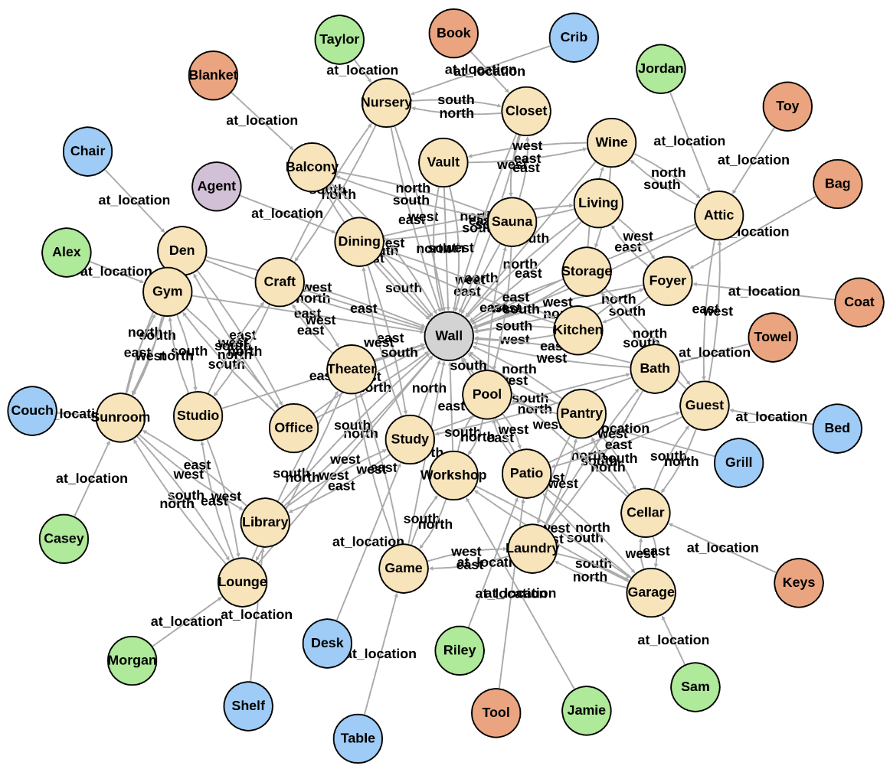

# The Room environments (compatible with gymnasium)

At the moment, there are three versions of the Room environments.

[Training agents for these environments are in a separate
repo](https://github.com/humemai/humemai).

## README for each version

- [RoomEnv-v0](./README-v0.md)
- [RoomEnv-v1](./README-v1.md)
- [RoomEnv-v2](./README-v2.md)

## List of academic papers that use the Rooms environments

- ["A Machine With Human-Like Memory Systems"](https://arxiv.org/abs/2204.01611)
- ["A Machine with Short-Term, Episodic, and Semantic Memory
  Systems"](https://arxiv.org/abs/2212.02098)
<!-- - ["Leveraging Knowledge Graph-Based Human-Like Memory Systems to Solve Partially Observable Markov Decision Processes"](https://arxiv.org/abs/2408.05861) -->

## pdoc documentation

Click on [this link](https://humemai.github.io/room-env) to see the HTML rendered
docstrings

## Contributing

Contributions are what make the open source community such an amazing place to be learn,
inspire, and create. Any contributions you make are **greatly appreciated**.

1. Fork the Project
1. Create your Feature Branch (`git checkout -b feature/AmazingFeature`)
1. Run `make test && make style && make quality` in the root repo directory, to ensure
   code quality.
1. Commit your Changes (`git commit -m 'Add some AmazingFeature'`)
1. Push to the Branch (`git push origin feature/AmazingFeature`)
1. Open a Pull Request

## License

[MIT](https://choosealicense.com/licenses/mit/)

## Authors

- [Taewoon Kim](https://taewoon.kim/)
